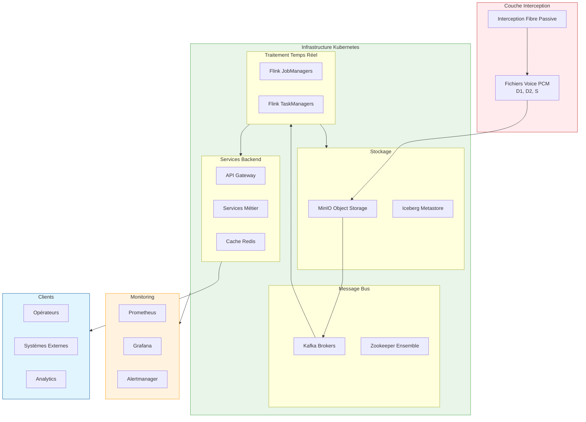
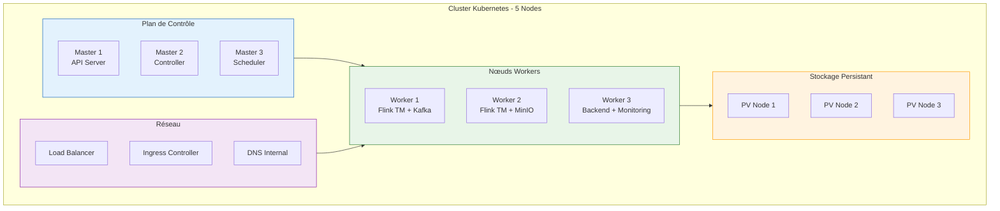
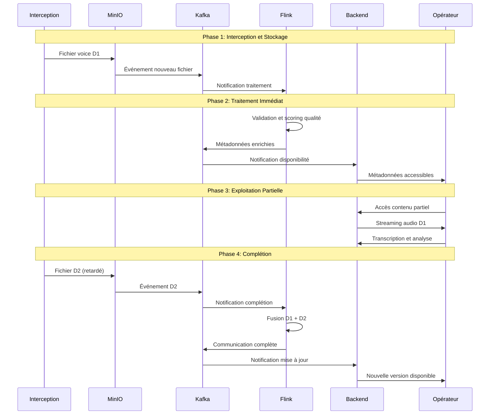
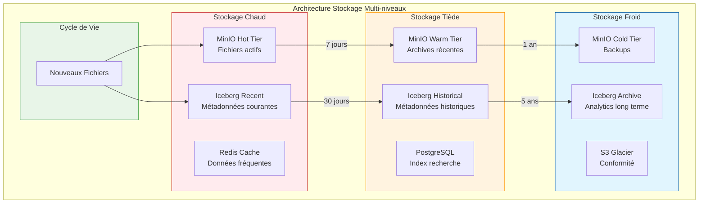
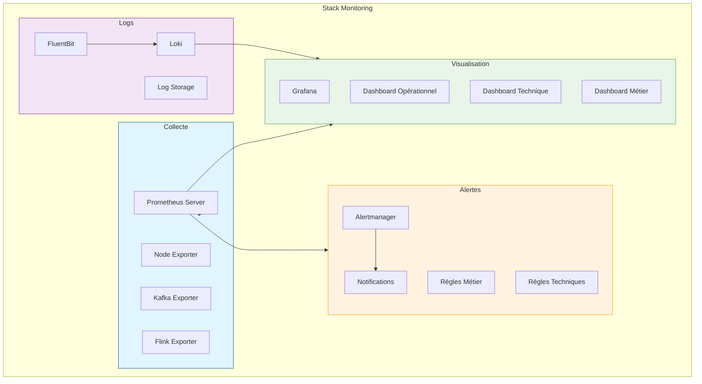
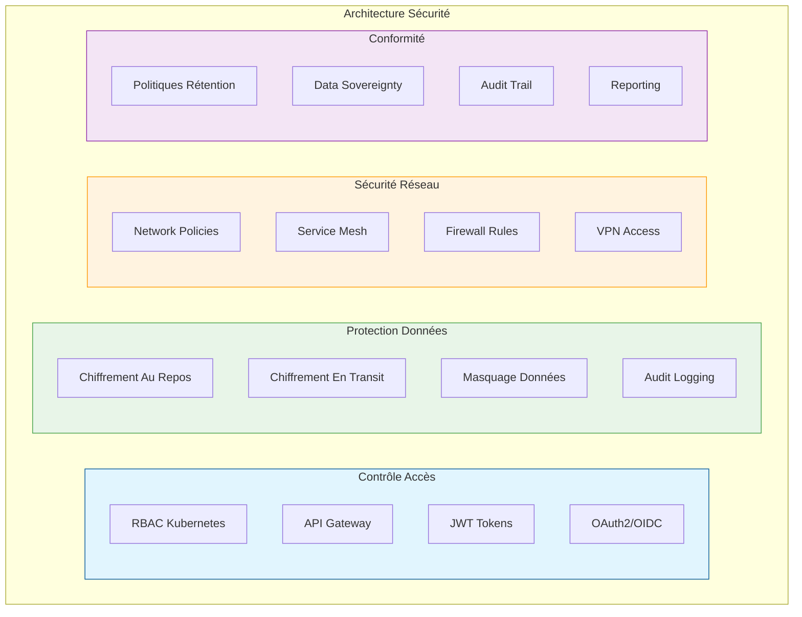
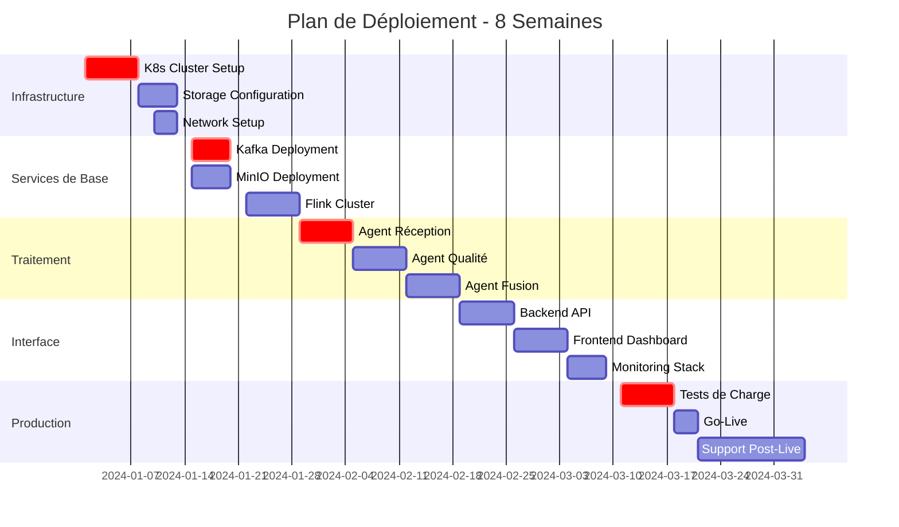

📋 Projet Complet : Système de Traitement des Communications Voice

🎯 Table des Matières

1. Contexte et Objectifs
2. Architecture Globale
3. Déploiement et Infrastructure
4. Flux de Traitement Détaillé
5. Gestion des Données
6. Monitoring et Alertes
7. Sécurité et Conformité
8. Plan de Déploiement
9. Structure GitLab
10. Gestion des Évolutions

---

🎯 Contexte et Objectifs

Problématique

Système d'interception passive de communications voice sur circuits fibre avec défis spécifiques :

· Retards variables (multi-circuits)
· Doublons et corruptions
· Besoin d'exploitation temps réel
· Volumes importants

Objectifs

· ✅ Traitement temps réel des communications voice
· ✅ Gestion élégante des retards jusqu'à 4 heures
· ✅ Exploitation progressive (partielle → complète)
· ✅ Haute disponibilité et scalabilité
· ✅ Conformité et sécurité

---

🏗️ Architecture Globale

Architecture Haut Niveau



Responsabilités par Composant

Composant Responsabilité Technologie
Kafka Bus d'événements et découplage Apache Kafka
Flink Cerveau du traitement temps réel Apache Flink
MinIO Stockage fichiers voice MinIO
Iceberg Métadonnées structurées Apache Iceberg
Backend Interface utilisateurs Spring Boot/Node.js
Kubernetes Orchestration conteneurs K8s

---

🚀 Déploiement et Infrastructure

Topologie Kubernetes



Configuration des Ressources

```yaml
# Values pour Helm Charts
resources:
  kafka:
    brokers: 3
    storage: "500Gi"
    memory: "16Gi"
    
  flink:
    taskmanagers: 3
    slots_per_tm: 4
    memory: "8Gi"
    
  minio:
    nodes: 4
    storage: "2Ti"
    replication: "2"
    
  backend:
    replicas: 3
    memory: "4Gi"
```

---

🔄 Flux de Traitement Détaillé

Flux Complet End-to-End



Gestion de la Transition Partielle → Complète

```mermaid
graph TB
    subgraph TRANSITION [Transition Partielle → Complète]
        subgraph INITIAL [État Initial]
            P1[🟡 Communication Partielle]
            P2[📊 Rapport Partiel Généré]
            P3[🚨 Alertes Actives]
            P4[👥 Opérateurs Impliqués]
        end
        
        subgraph TRIGGER [Événement Déclencheur]
            T1[✅ Réception D2]
            T2[🔗 Fusion D1 + D2]
            T3[📢 Notification Changement]
        end
        
        subgraph ACTIONS [Actions de Mise à Jour]
            A1[🔄 Regénération Transcription]
            A2[📋 Mise à Jour Rapport]
            A3[🎯 Réévaluation Alertes]
            A4[👁️ Notification Opérateurs]
        end
        
        subgraph RESULTAT [État Final]
            R1[🟢 Communication Complète]
            R2[📄 Rapport Définitif]
            R3[🔔 Alertes Contextualisées]
            R4[📚 Historique Préservé]
        end
    end
    
    INITIAL --> TRIGGER --> ACTIONS --> RESULTAT

    classDef initial fill:#fff3e0,stroke:#ff9800
    classDef trigger fill:#e8f5e8,stroke:#43a047
    classDef actions fill:#e1f5fe,stroke:#01579b
    classDef result fill:#f3e5f5,stroke:#8e24aa
    
    class INITIAL initial
    class TRIGGER trigger
    class ACTIONS actions
    class RESULTAT result
```



Détail des Actions de Mise à Jour

Quand une communication passe de partielle à complète :

1. 🔄 Retraitement Automatique
   · Regénération transcription complète
   · Réanalyse du contenu contextuel
   · Recalcul des métriques de qualité
2. 📋 Gestion des Versions
   ```
   Communication call_12345:
   ├── 📄 Version 1.0 (Partielle)
   │   ├── Statut: 🟡 PARTIEL
   │   ├── Contenu: D1 seulement
   │   └── Rapport: Provisoire
   └── 📄 Version 2.0 (Complète)
       ├── Statut: 🟢 COMPLET
       ├── Contenu: D1 + D2 fusionnés
       └── Rapport: Définitif
   ```
3. 👁️ Notification des Opérateurs
   · WebSocket : Notification temps réel
   · Email : Résumé des changements
   · Dashboard : Indicateur visuel
4. 🎯 Mise à Jour des Alertes
   · Réévaluation des alertes existantes
   · Nouvelles alertes contextuelles
   · Escalade si nécessaire

---

💾 Gestion des Données

Architecture de Stockage



Structure des Données

```
MinIO Buckets:
├── voice-raw/
│   ├── by-date/2024/01/15/call_12345_D1_v1.pcm
│   └── by-call/call_12345/D1 -> symlink
├── voice-processed/
│   ├── complete/
│   ├── partial/
│   └── alternatives/
└── voice-archive/
    ├── quality-a/
    ├── quality-b/
    └── quality-c/

Iceberg Tables:
├── voice_files (métadonnées fichiers)
├── call_communications (états communications)
├── fusion_decisions (décisions fusion)
├── quality_metrics (métriques qualité)
└── audit_trail (piste d'audit)
```

---

📊 Monitoring et Alertes

Architecture Monitoring



Métriques Critiques

```yaml
key-metrics:
  business:
    - fusion_success_rate: "> 99%"
    - time_to_first_analysis: "< 2min"
    - partial_utilization_rate: "> 90%"
    
  technical:
    - processing_latency: "< 60s"
    - kafka_lag: "< 100 messages"
    - system_availability: "> 99.9%"
    
  quality:
    - average_quality_score: "> 0.8"
    - corruption_rate: "< 1%"
    - duplicate_rate: "< 5%"
```

---

🛡️ Sécurité et Conformité

Architecture de Sécurité



---

📅 Plan de Déploiement

Roadmap Détaillée



Checklist Pré-Production

· Tests de charge : 1M fichiers/jour
· Tests de résilience : Pannes composants
· Tests de sécurité : Penetration testing
· Documentation utilisateur
· Formation équipes
· Procédures d'urgence

---

🔧 Structure GitLab

Organisation des Dépôts

```
gitlab.com/voice-processing/
├── 📁 infrastructure/
│   ├── 📄 kubernetes/
│   │   ├── namespaces/
│   │   ├── kafka/
│   │   ├── flink/
│   │   └── monitoring/
│   ├── 📄 terraform/
│   │   ├── network/
│   │   ├── compute/
│   │   └── storage/
│   └── 📄 helm-charts/
│       ├── kafka-cluster/
│       ├── flink-job/
│       └── voice-backend/
│
├── 📁 processing/
│   ├── 📄 flink-jobs/
│   │   ├── voice-ingestion/
│   │   ├── voice-quality/
│   │   ├── voice-correlation/
│   │   └── voice-fusion/
│   ├── 📄 connectors/
│   │   ├── kafka-connector/
│   │   ├── minio-connector/
│   │   └── iceberg-connector/
│   └── 📄 shared-libs/
│       ├── voice-models/
│       └── common-utils/
│
├── 📁 backend/
│   ├── 📄 api-gateway/
│   ├── 📄 voice-service/
│   ├── 📄 streaming-service/
│   ├── 📄 alerting-service/
│   └── 📄 auth-service/
│
├── 📁 frontend/
│   ├── 📄 operator-dashboard/
│   ├── 📄 admin-console/
│   └── 📄 reporting-ui/
│
├── 📁 monitoring/
│   ├── 📄 prometheus/
│   ├── 📄 grafana/
│   ├── 📄 alert-rules/
│   └── 📄 dashboards/
│
└── 📁 docs/
    ├── 📄 architecture/
    ├── 📄 api-documentation/
    ├── 📄 operational-guides/
    └── 📄 compliance/
```

Pipelines CI/CD

```yaml
# .gitlab-ci.yml exemple
stages:
  - test
  - build
  - security-scan
  - deploy-dev
  - deploy-staging
  - deploy-prod

variables:
  K8S_NAMESPACE: "voice-processing"

# Pipeline pour Flink Jobs
flink-job-pipeline:
  stage: build
  script:
    - mvn clean package
    - flink run target/voice-ingestion.jar
  only:
    - main
    - develop

# Pipeline pour Backend
backend-pipeline:
  stage: build  
  script:
    - docker build -t voice-backend .
    - helm upgrade backend helm-charts/voice-backend
  environment: production
```

---

🔄 Gestion des Évolutions

Stratégie de Versioning

```
Versioning Semantic: MAJOR.MINOR.PATCH
- MAJOR: Changements non rétrocompatibles
- MINOR: Nouvelles fonctionnalités rétrocompatibles  
- PATCH: Corrections bugs

Exemple: v2.1.3
- 2: Refonte majeure architecture
- 1: Ajout analyse sémantique
- 3: Correctifs performance
```

Plan d'Évolution

Phase 1 (v1.x) : Fonctionnalités de Base

· Traitement voix basique
· Fusion D1/D2 simple
· Interface opérateur essentielle

Phase 2 (v2.x) : Intelligence Avancée

· Machine Learning qualité
· Analyse sémantique
· Détection patterns

Phase 3 (v3.x) : Écosystème Étendu

· Intégration systèmes externes
· APIs publiques
· Analytics avancés

---

✅ Conclusion et Bilan

Points Clés de Réussite

1. 🎯 Exploitation Progressive
   · Données disponibles immédiatement
   · Qualité améliorée progressivement
   · Time-to-value optimal
2. 🛡️ Résilience et Robustesse
   · Gestion élégante des pannes
   · Tolérance aux retards
   · Reprise automatique
3. 📈 Scalabilité et Performance
   · Architecture microservices
   · Scaling horizontal
   · Performance temps réel
4. 🔐 Sécurité et Conformité
   · Chiffrement end-to-end
   · Audit complet
   · Contrôles d'accès granulaires

Métriques de Succès

Catégorie Métrique Cible
Performance Latence traitement < 60 secondes
Disponibilité Uptime système 99.9%
Qualité Taux fusion réussie 99%
Business Time-to-first-analysis < 2 minutes

Prochaines Étapes

1. 🚀 Déploiement Phase 1 (Semaines 1-4)
2. 🔧 Optimisation Performance (Semaines 5-8)
3. 🎯 Formation Utilisateurs (Semaine 9)
4. 📊 Revue et Amélioration (Semaine 10)

Ce projet fournit une solution complète et industrielle pour le traitement des communications voice interceptées, combinant performance temps réel, résilience opérationnelle et évolutivité future. 🚀

---

Document généré le : 2024-01-15
Version : 1.0
Statut : Final
